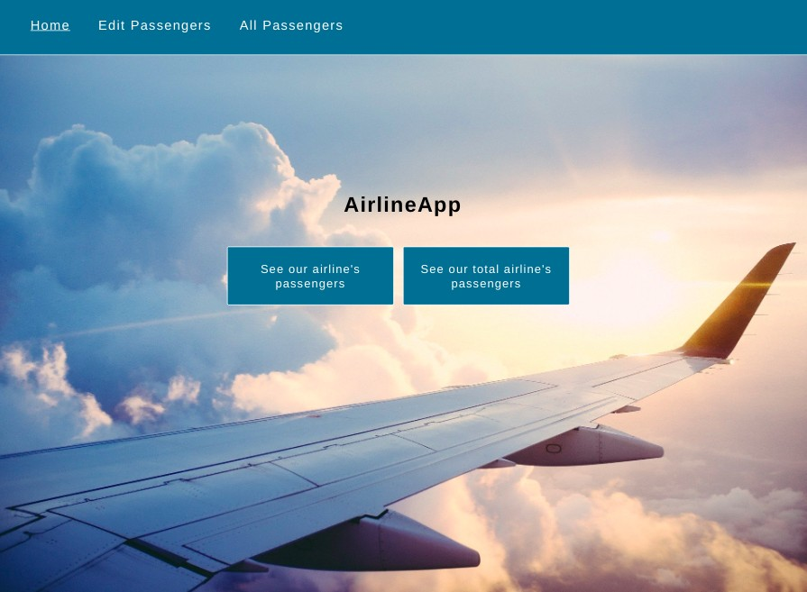
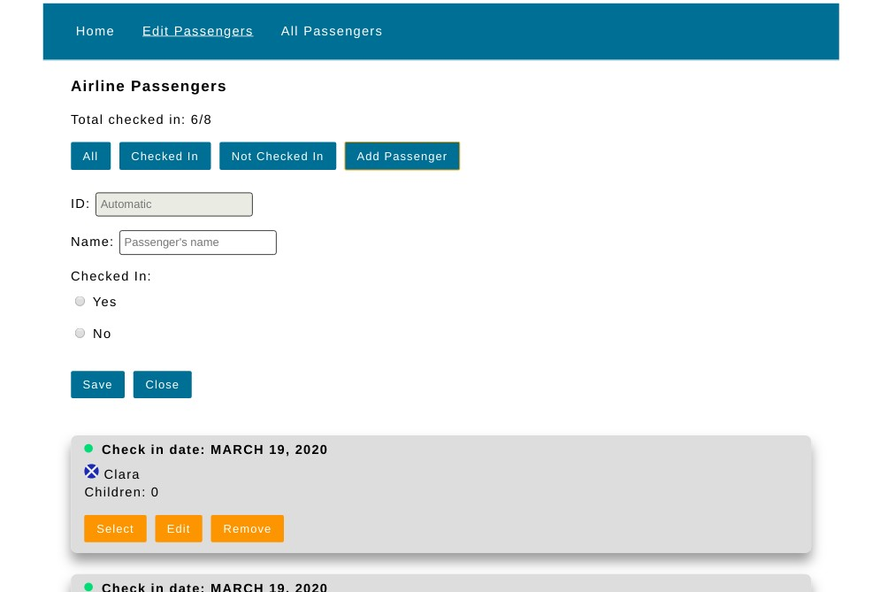

# AirlineApp ✈️__✈️

Airline is an app to show the airline's passengers and their information.

In Edit Passengers section, user can filter the passengers by all, who checked in or not checked in. User can add a new passenger.

In each passenger, user can edit the passenger's name, remove the passenger or make the check in for the users not checked in. If user select a passenger, they can edit more fields of their information (name, check in, check in date and luggage. ID must not change)

In All Passengers section, user can see all passengers.

 

 
## Instrucions to run the project

## Project setup

Run the following command to install dependencies:

```
npm install
```

### Start the json-server
If you don't have installed json-server:

```
npm install -g json-server
```
to start the server:

```
json-server --watch db.json
```

### Start the client
```
ng server
```
## Technologies

JS && Angular 9 && Sass